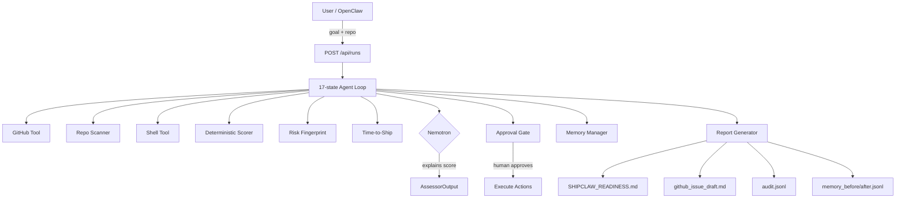

# 🚢 ShipClaw

> **Bounded autonomous release-readiness agent.** Give it a GitHub repo and a goal — it tells you if you're ready to ship, what's blocking you, and exactly how long it will take to fix.

Built for [shortesthack.com](https://shortesthack.com).

---

## What it does

ShipClaw runs a 17-state agent loop that:

1. **Fetches GitHub data** — CI status, open issues, PR health, latest commit
2. **Scans the repository** — README, tests, CHANGELOG, security policy, lock files
3. **Runs safe local checks** — `typecheck`, `test` (read-only, allowlisted commands only)
4. **Calculates a deterministic readiness score** — 0–100 across 6 weighted categories
5. **Builds a Release Risk Fingerprint** — using memory from prior runs
6. **Estimates time-to-ship** — visible heuristics, not black-box AI
7. **Calls Nemotron** — to _explain_ the score (never to invent or override it)
8. **Proposes approval-gated actions** — human reviews before anything is executed
9. **Writes 6 artifacts** — polished report, issue draft, audit log, memory snapshots

---

## Quick start

```bash
# 1. Clone
git clone https://github.com/meetbhadra701-cloud/shipclaw.git
cd shipclaw

# 2. Install
npm install

# 3. Configure (paste your real keys)
cp .env.example .env.local
# Edit .env.local with NEMOTRON_API_KEY, GITHUB_TOKEN, etc.

# 4. Demo run (no API keys needed)
DEMO_MODE=true ALLOW_LLM_FALLBACK=true \
  npm run agent:run -- \
  --repo https://github.com/owner/repo \
  --goal "Check release readiness" \
  --demo \
  --auto-approve-local

# 5. Open the dashboard
npm run dev
# → http://localhost:5173
```

---

## Score bands

| Score | Band | Status |
|---|---|---|
| 71–100 | READY | ✅ Ship |
| 41–70 | RISKY | ⚠️ Fix blockers first |
| 0–40 | NOT_READY | 🔴 Not ready |

### Score categories and weights

| Category | Weight | What it checks |
|---|---|---|
| CI Health | 25% | Passing workflows, build status |
| Test Coverage | 20% | Test files present, coverage % |
| Open Blockers | 20% | Critical issues, unreviewed PRs |
| Documentation | 15% | README, CHANGELOG, docs |
| Security | 10% | Dependabot alerts, exposed secrets |
| Dependency Freshness | 10% | Outdated major versions |

---

## Architecture



**Key invariant:** Nemotron sees the numeric score and explains it. It does not invent, recalculate, or override the score. The score is computed deterministically by `src/agent/scorer.ts` before any LLM call.

---

## API reference

Server runs on `:8787`.

| Method | Endpoint | Description |
|---|---|---|
| `POST` | `/api/runs` | Start a run |
| `GET` | `/api/runs/:id` | Get run status |
| `GET` | `/api/runs/:id/events` | SSE event stream |
| `POST` | `/api/approvals/:id/approve` | Approve action |
| `POST` | `/api/approvals/:id/reject` | Reject action |
| `GET` | `/api/memory` | Cross-run memory |
| `GET` | `/api/audit/:runId` | Audit log |
| `GET` | `/api/reports/:runId` | List artifacts |
| `GET` | `/api/reports/:runId/readiness` | Readiness report markdown |

### Start a run

```bash
curl -X POST http://localhost:8787/api/runs \
  -H "Content-Type: application/json" \
  -d '{"goal": "Check release readiness", "repo": "https://github.com/owner/repo"}'
```

### Stream events

```bash
curl -N http://localhost:8787/api/runs/<runId>/events
```

---

## CLI usage

```bash
# Live mode (requires NEMOTRON_API_KEY and GITHUB_TOKEN)
npm run agent:run -- \
  --repo https://github.com/owner/repo \
  --goal "Check release readiness for v2.0"

# Demo mode (fixture data, no API calls)
npm run agent:run -- \
  --repo fixtures/demo \
  --goal "Demo run" \
  --demo \
  --auto-approve-local
```

---

## Output artifacts

All artifacts land in `runs/<runId>/`:

| File | Description |
|---|---|
| `SHIPCLAW_READINESS.md` | Full 14-section report (judge-visible) |
| `github_issue_draft.md` | Ready-to-paste GitHub issue |
| `audit.jsonl` | Per-event audit trail (append-only) |
| `memory_before.jsonl` | Memory snapshot before run |
| `memory_after.jsonl` | Memory snapshot after run |
| `memory_diff.md` | Human-readable memory diff |

---

## Environment variables

```bash
# Required for live mode
NEMOTRON_API_KEY=your-nvidia-api-key
NEMOTRON_BASE_URL=https://integrate.api.nvidia.com/v1
NEMOTRON_MODEL=mistralai/mistral-nemotron
GITHUB_TOKEN=your-github-token

# Optional — Exa external evidence (see "Exa integration" section below)
EXA_API_KEY=your-exa-key
ENABLE_EXA=false           # Set to true to enable (also accepts EXA_ENABLED=true)
EXA_TIMEOUT_MS=8000        # Per-search timeout in milliseconds
EXA_MAX_SEARCHES_PER_RUN=3 # Hard cap — never more than 3 Exa calls per run

# Demo/dev mode
DEMO_MODE=false            # Set to true for fixture data
ALLOW_LLM_FALLBACK=false   # Set to true to use fallback when Nemotron unavailable
PORT=8787
```

---

## Development

```bash
# Install dependencies
npm install

# Typecheck
npm run typecheck

# Tests
npm test

# Smoke test (no network)
npm run smoke

# Start dev server (backend + Vite)
npm run dev

# Backend only
npm run server

# Demo run
npm run seed:demo
```

---

## Dashboard panels

The React dashboard renders 13 panels:

1. **Goal** — run configuration form
2. **Plan** — analysis steps overview
3. **Agent Activity** — live SSE event stream (`role="log"`)
4. **Readiness Score** — deterministic score + progress bar + breakdown table
5. **Risk Fingerprint** — per-signal severity table with memory provenance
6. **Time-to-Ship** — estimate range + heuristic reasons
7. **Findings** — score breakdown table, top blockers, recommended actions
8. **Approval** — approval-gated actions (`role="alert"`, auto-focused)
9. **Live Report Preview** — react-markdown rendering of `SHIPCLAW_READINESS.md`
10. **Final Decision** — ship/hold verdict badge
11. **Memory** — cross-run key/value memory store
12. **Audit Log** — per-run audit trail
13. **External Evidence** — Exa results (when enabled)

### Accessibility

The dashboard is WCAG AA compliant:
- Skip link to main content
- Score band colours verified ≥4.5:1 contrast ratio
- `role="log"` on agent timeline, `aria-live="polite"` on score
- Approval panel has `role="alert"` and receives focus when triggered
- Full keyboard navigation, no mouse-only interactions
- Reduced motion support via `prefers-reduced-motion`

---

## Agent loop states

```
INIT → LOAD_MEMORY → PLAN → FETCH_GITHUB_DATA → SCAN_REPO →
RUN_SAFE_CHECKS → CALCULATE_SCORE → BUILD_RISK_FINGERPRINT →
ESTIMATE_TIME_TO_SHIP → OPTIONAL_EXA_EXTERNAL_EVIDENCE →
ASSESS_WITH_NEMOTRON → PROPOSE_ACTIONS → WAIT_FOR_APPROVAL →
EXECUTE_APPROVED_ACTIONS → UPDATE_MEMORY → WRITE_ARTIFACTS → FINALIZE
```

---

## Two-agent collaboration protocol

ShipClaw is built using a two-agent collaboration model:

- **Claude (me)** — Senior Architect + Integrator. Owns: agent loop spine, type contracts, storage schema, Nemotron prompt + assessor, report generator, memory adapter, Express server, React dashboard, OpenClaw skill, docs.
- **Codex** — Boilerplate + algorithms. Owns: scorer implementation, risk fingerprint algorithm, time-to-ship heuristics, SQLite DB adapter, tool implementations (GitHub, repo, shell, Exa), UI component internals, tests.

All coordination happens via `COMMUNICATION_LOG.md` and `TASK_STATE.md`, committed to git after each meaningful unit of work.

---

## Exa integration

ShipClaw optionally uses [Exa.ai](https://exa.ai) to surface external documentation context when the deterministic score detects uncertainty.

### What Exa does

Exa searches **public documentation only** — package docs, framework guides, changelogs, known setup gotchas, and deprecation notices. It is called only when the deterministic analysis reveals genuine uncertainty:

- Documentation category failing (README may not match current framework docs)
- Dependency freshness failing (packages may have known compatibility issues)
- Observations with native/setup/deployment signals
- Score in NOT_READY band

### What Exa does NOT do

- Does not replace GitHub inspection, local repo scanning, or deterministic scoring
- Does not override direct repo evidence
- Does not send secrets, `.env` values, private repo contents, or full source files
- Does not use Exa Deep Search (MVP uses highlights only)
- Does not run unless both `ENABLE_EXA=true` AND `EXA_API_KEY` are set

### Safety rules (enforced in code)

| Rule | Enforcement |
|---|---|
| Disabled by default | `ENABLE_EXA=false` in `.env.example` |
| No API key → skip silently | Key check before every call |
| Max 3 searches/run | `EXA_MAX_SEARCHES_PER_RUN=3` (hard cap) |
| 8 second timeout | `AbortController` per request |
| Exa failure → run continues | All errors caught, return `[]` |
| Only public queries sent | `sanitizeQuery()` strips env vars, tokens, file paths |
| Labeled as "External Evidence" | Every report section and UI panel uses this label |
| Cannot override repo evidence | Evidence appended to context, not merged into score |

### Enable Exa

```bash
# In .env.local (gitignored)
ENABLE_EXA=true
EXA_API_KEY=your-exa-key
EXA_TIMEOUT_MS=8000
EXA_MAX_SEARCHES_PER_RUN=3
```

Then run:

```bash
DEMO_MODE=true ALLOW_LLM_FALLBACK=true npm run agent:run -- --repo https://github.com/owner/repo --goal "Check release readiness"
```

The report section `## 🌐 External Evidence Check` shows **Status: live** with results, or **Status: skipped** with the reason when disabled.

---

## Safety

- **Secrets never enter** the repo, logs, `COMMUNICATION_LOG.md`, `TASK_STATE.md`, commits, or reports.
- **All risky writes** require human approval via `POST /api/approvals/:id/approve`.
- **Fallback mode** is clearly labeled in UI and reports — no silent degradation.
- **Exa is off by default** — no data leaves the system unless explicitly enabled. See "Exa integration" above.
- **Shell commands** run through an allowlist (`npm run typecheck`, `npm test` only).

---

## Known limitations

- **better-sqlite3** was replaced with Node 24's native `node:sqlite` (X-001 complete by Codex).
- **GitHub live mode** uses the `github.ts` stub in demo mode. Full Octokit integration is a Codex task (X-005).
- **Real shell checks** (`npm run typecheck`, `npm test`) run against the ShipClaw project itself in demo mode, not the target repo.

---

## Submission

Built for [shortesthack.com](https://shortesthack.com) hackathon.

- **Repo:** https://github.com/meetbhadra701-cloud/shipclaw
- **Demo command:** `DEMO_MODE=true ALLOW_LLM_FALLBACK=true npm run smoke`
- **Dashboard:** `npm run dev` → http://localhost:5173
- **OpenClaw invocation:** `openclaw agent --message "Check release readiness for https://github.com/owner/repo"` (after `npm run install-openclaw-skill`)

---

## Troubleshooting

### `better-sqlite3` fails to compile on Node 24

```
gyp ERR! build error
```

**Cause:** `better-sqlite3` requires native bindings that don't compile cleanly on Node 24 due to a `node-gyp` issue.

**Fix:** ShipClaw automatically falls back to `InMemoryDb` — all functionality works. SQLite persistence will be added when the upstream binary is fixed or Codex ships X-001.

```bash
npm install --ignore-scripts  # skip native build
```

### `tsx` not found

```
Cannot find module '.../tsx/dist/cli.mjs'
```

**Fix:** Run `npm install` first. All scripts use explicit `node node_modules/tsx/dist/cli.mjs` paths to avoid `.bin/` symlink issues on Node 24.

### SSE stream disconnects immediately

The server uses 500ms polling intervals. Ensure the server is running (`npm run server`) before starting Vite (`npm run dev`), or use `npm run dev` which starts both concurrently.

### Nemotron returns invalid JSON

The assessor has a full fallback path. If `NEMOTRON_API_KEY` is unset or invalid, ShipClaw runs in fallback mode and labels all output clearly. No crash.

### Port 8787 already in use

```bash
PORT=8788 npm run server
```

Update `vite.config.ts` proxy target to match.

---

## Stretch goals

- **C-EXA:** ✅ Complete — Exa external evidence is implemented. See "Exa integration" section above.
- **C-NEMO:** NemoClaw/GX10 — run Nemotron on a local GPU via Brev. Requires explicit user approval for paid compute. Draft setup documented separately.
- **SQLite persistence (X-001):** ✅ Complete — Codex implemented `SqliteDb` using Node 24 `node:sqlite`.
- **Real GitHub tool (X-005):** Full Octokit + simple-git integration for live repo analysis. Codex-owned.
- **Test suite (X-006):** Expand vitest unit tests for riskFingerprint, timeToShip, assessor fallback, memory diff. Codex-owned.

---

## Reconstruct exclusion

Reconstruct is explicitly excluded from ShipClaw per the system manual. No Reconstruct API calls, no Reconstruct dependencies, no Reconstruct setup.

---

*Generated by Claude Sonnet — ShipClaw Senior Architect + Integrator.*
